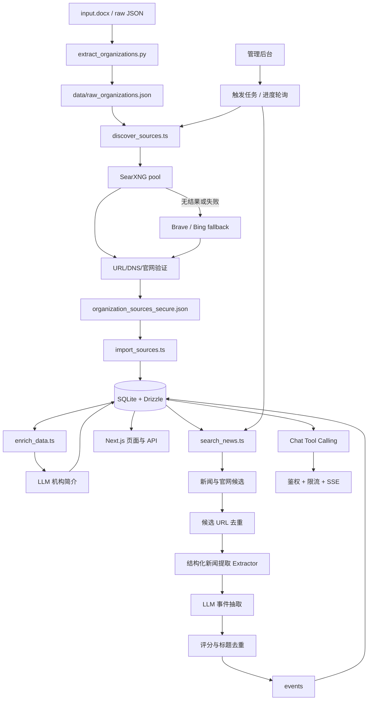

# Institution Intelligence

> ⚠️ 注意：`npm run ai:enrich` 是生成机构简介的必需步骤。导入机构和来源不会自动生成简介，完成来源导入后必须执行该命令。

### 标准运行流程

```bash
npm run data:extract-organizations
npm run data:discover-sources
npm run db:import-sources
npm run ai:enrich
npm run ai:search-news
# 5. 生成每日 AI 情报简报 (需配置 WEBHOOK_URL)
npm run ai:daily-briefing
```

核心能力包括数据库级事件防重、全链路时间窗口控制、高并发连接控制，以及数据漏斗可观测日志。

`SEARXNG_ENGINES` 控制 SearXNG 引擎列表；`MIN_RELEVANCE_SCORE` 控制事件最低相关性评分（默认 4）。并发和超时可通过 `SEARXNG_CONCURRENCY`、`HOMEPAGE_CONCURRENCY`、`LLM_CONCURRENCY`、`HTTP_TIMEOUT_MS` 等变量调整，默认值保持现有行为。

Institution Intelligence 是一个面向研究、投资和产业团队的机构情报系统。项目采用“安全基座 + AI 引擎”架构，将公开机构资料、官网来源和新闻事件整理为可检索、可追溯的数据资产。

仅允许采集合法授权的公开信息。请遵守目标站点的 robots 规则、服务条款、频率限制及适用法律。

## 核心特性

### 数据管道

- 📄 DOCX/JSON 机构名称提取、标准化与去重
- 🔎 SearXNG 多实例来源发现
- 🔁 SearXNG 失败时按顺序使用 Brave/Bing fallback
- 🛡️ URL 协议、DNS 公网地址和官网内容验证
- 💾 SQLite/Drizzle 增量导入、checkpoint 与原子备份

### AI 治理

- 🧹 官网正文清洗和机构简介生成
- 🤖 LLM 事件抽取、分类和摘要
- 🧠 智能降噪与 Token 优化：集成结构化新闻提取器，自动剥离网页噪声，将 LLM 输入 Token 消耗降低 30%-70%，并支持多平台规则与通用 Fallback
- 📰 每日 AI 情报简报：支持定时聚合高相关性事件，通过 LLM 生成结构化洞察报告，并一键推送到飞书/钉钉/企业微信等 Webhook 渠道
- 📊 `relevanceScore` 评分，默认过滤低于 6 分的事件
- ♻️ 标题相似度去重和跨批次 URL 去重
- 💬 `search_institution_database` Tool Calling 防止无依据回答

### 安全与鉴权

- 🔐 用户会话鉴权和会话撤销
- 🚦 用户维度速率限制与请求体大小限制
- 🌐 私网、环回地址、保留地址和非官方域名阻断
- 🔒 管理员 API Token 校验
- 📡 SSE 错误脱敏和上游超时控制

### 可视化调度

- 📈 来源发现和事件搜索进度文件
- 🖥️ 管理后台触发任务并轮询进度
- ⏯️ 按机构状态断点恢复
- 🧾 失败任务、困难机构和历史结果备份

## 系统架构



## 技术栈

- Next.js、React、TypeScript、Vinext
- Drizzle ORM、SQLite、`@libsql/client`
- Ollama 或 OpenAI-compatible LLM
- SearXNG、Brave Search API、Bing Search API
- Undici、Cheerio
- Node Test Runner、ESLint、TypeScript

## 快速开始

环境要求：Node.js `>=22.13.0`、npm、Python 3（仅提取 DOCX 时需要）、独立运行的 SearXNG，以及可选的 Ollama。

```bash
npm install
npm run db:generate
npm run db:init
npm run data:extract-organizations
npm run data:discover-sources
npm run db:import-sources
npm run ai:enrich
npm run ai:search-news
# 5. 生成每日 AI 情报简报 (需配置 WEBHOOK_URL)
npm run ai:daily-briefing
npm run dev
```

### 初始化首个管理员账号

复制 `.env.example` 为 `.env.local`，配置 `AUTH_EMAIL` 和 `AUTH_PASSWORD`。启动服务后，访问 `/login` 并使用该账号密码登录，系统将自动完成账号初始化。生产环境请配置 `AUTH_PASSWORD_HASH`，不要使用明文 `AUTH_PASSWORD`。

常用命令：

```bash
npm run data:discover-sources -- --searxng --resume --limit 20
npm run ai:search-news -- --resume --limit 50
npm run ai:translate
npm run lint
npm test
```

## 环境变量

复制 `.env.example` 为 `.env.local`，不要提交真实密钥。

| 变量 | 说明 |
| --- | --- |
| `LOCAL_SQLITE_PATH` | 本地 SQLite 文件路径 |
| `LLM_BASE_URL` | Ollama 或其他 OpenAI-compatible 地址 |
| `LLM_API_KEY` | LLM API 密钥；本地 Ollama 通常为 `ollama` |
| `LLM_MODEL_NAME` | LLM 模型名称 |
| `FINE_TUNED_MODEL_BASE_URL` | 可选微调模型地址 |
| `FINE_TUNED_MODEL_NAME` | 可选微调模型名称 |
| `SEARXNG_URLS` | 逗号分隔的 SearXNG 实例池 |
| `SEARXNG_URL` | 单实例兼容配置 |
| `SEARXNG_ENGINES` | SearXNG 引擎列表，默认值为 `google,bing,duckduckgo,baidu,startpage,qwant`。系统支持多引擎配置，若实例不支持 `engines` 参数会自动降级查询。 |
| `BRAVE_SEARCH_API_KEY` | Brave fallback 密钥 |
| `BING_SEARCH_API_KEY` | Bing fallback 密钥 |
| `AUTH_EMAIL` | 初始登录邮箱 |
| `AUTH_PASSWORD` | 本地初始化密码 |
| `AUTH_PASSWORD_HASH` | 生产环境密码哈希 |
| `AUTH_SESSION_SECRET` | 会话签名密钥 |
| `CREDENTIAL_ENCRYPTION_KEY` | Worker 凭据加密密钥 |
| `ADMIN_API_TOKEN` | 管理后台 API Token |
| `ENABLE_NEWS_EXTRACTOR` | 是否启用结构化新闻提取器，默认 `false` |
| `NEWS_EXTRACTOR_CONCURRENCY` | Extractor 并发 URL 数，默认 `4` |
| `NEWS_EXTRACTOR_TIMEOUT_MS` | Extractor 单 URL 请求超时（毫秒），默认 `12000` |
| `NEWS_EXTRACTOR_MAX_CHARS` | 传给 LLM 的正文最大字符数，默认 `8000` |
| `NEWS_EXTRACTOR_MIN_BODY_CHARS` | 判定正文提取成功的最小字符数，默认 `160` |
| `ENABLE_DAILY_BRIEFING` | 是否启用每日简报任务，默认 `false` |
| `DAILY_BRIEFING_LOOKBACK_HOURS` | 简报查询时间窗口，默认最近 `24` 小时 |
| `DAILY_BRIEFING_MIN_SCORE` | 纳入简报的最低相关性分数，默认 `6` |
| `DAILY_BRIEFING_MAX_EVENTS` | 单次简报最多处理事件数，默认 `60` |
| `DAILY_BRIEFING_MAX_OUTPUT_TOKENS` | LLM 简报输出上限，默认 `3000` tokens |
| `WEBHOOK_PROVIDER` | 推送平台：`feishu`、`dingtalk`、`wework` 或 `generic` |
| `WEBHOOK_URL` | 通用 Webhook 地址；为空时跳过推送 |
| `WEBHOOK_TIMEOUT_MS` | Webhook 请求超时（毫秒），默认 `15000` |
| `WEBHOOK_RETRY_COUNT` | 网络错误或 5xx 的重试次数，默认 `2` |

## 管理后台

访问 `/admin`，使用管理员 Token 验证后可触发：

- 机构来源搜索：`POST /api/admin/trigger-search`
- 事件搜索：`POST /api/admin/trigger-event-search`
- 来源进度：`GET /api/admin/search-progress`
- 事件进度：`GET /api/admin/event-search-progress`

任务由独立 Node 子进程执行。后台通过进度文件轮询显示处理数量、成功数量、失败数量和当前机构；任务中断后可使用 `--resume` 继续。

## 数据与安全

运行数据、密钥、`.local/`、`data/`、DOCX 输入、checkpoint 和备份文件不应提交到 Git。所有数据库写入使用参数化查询或 ORM；抓取任务必须遵守站点规则和频率限制。

## 交接与恢复

接收方应先执行 `npm ci`，从 `.env.example` 创建自己的 `.env.local`，再放入已交接的数据文件。不要复制发送方的 `.env.local`、历史环境备份或任何 API Key、Webhook、Cookie。首次使用空库时执行：

```bash
npm run db:init
npm run auth:create-first-admin
npm run dev
```

已有数据库在应用首次访问本地库时会进行幂等的缺列补齐；该过程只会新增列和索引，并在确有缺列时创建 `.before-schema-upgrade.<timestamp>` 备份。生产或重要交接库仍应先单独复制一份原始 SQLite 文件。`npm run db:init` 使用 Drizzle 迁移，适用于空库或已由同一迁移链管理的库；对来源不明的历史库，先复制备份并启动应用完成运行时校验。

### 数据库 Schema 兼容性

`organizations` 的运行时 Schema 除基础机构字段外，还包括：

- 来源与调度：`sources`、`last_searched_at`、`search_status`、`last_event_searched_at`、`event_search_status`
- 名称清洗审计：`cleaning_status`、`audit_note`、`retry_count`

`events` 还包括：`translated_title`、`translated_description`、`relevance_score`、`canonical_source_url`。后者与 `organization_id` 共同构成 URL 去重索引。不要通过手工建表省略这些列；否则事件搜索、管理 API 或清洗脚本可能在运行时返回 SQLite 缺列错误。

### 维护命令

先运行 `--dry-run`，确认目标库与输入 JSON 后，再执行会写库的命令。涉及 LLM 的命令要求 `.env.local` 中的 LLM 配置有效。

```bash
# 只读诊断 / 导出
npm run maintenance:diag-orgs
npm run maintenance:diag-org-names
node --env-file-if-exists=.env.local --import tsx scripts/maintenance/generate-cleaning-audit-json.ts
node --env-file-if-exists=.env.local --import tsx scripts/maintenance/export-cleaning-report.ts

# 名称清洗与审计同步（先 dry-run；写入前会要求输入 YES）
npm run maintenance:clean-org-names -- --dry-run
node --env-file-if-exists=.env.local --import tsx scripts/maintenance/apply-audit-tags.ts --dry-run
node --env-file-if-exists=.env.local --import tsx scripts/maintenance/retry-failed-names.ts --dry-run
node --env-file-if-exists=.env.local --import tsx scripts/maintenance/sync-audit-to-db.ts --dry-run

# 指定数据库的事件字段升级与本地鉴权库迁移
npm run db:migrate-events-schema
npm run auth:migrate-local
```

`apply-audit-tags.ts`、`retry-failed-names.ts` 和 `sync-audit-to-db.ts` 会在必要时幂等添加清洗审计列。`merge-databases.ts` 会创建目标库的预合并备份并写入目标库，只能在确认源库、目标库路径后运行。

### U 盘数据清单

必须传输：

- `.local/d1.sqlite`：业务数据和事件；`.local/auth.sqlite`：本地用户、会话与鉴权数据。两者均包含敏感运行数据，应使用加密介质。
- `data/raw_organizations.json`、`data/organization_sources_secure.json`、`data/known_domains_whitelist.json`：继续来源发现和导入所需的输入/结果。
- `data/manual_audit_sample.json`、`data/valid_names.json`：名称清洗审计与重试所需输入。
- 如需断点续跑，同时传输 `data/search_progress.json`、`data/enrich_progress.json`、`data/name_clean_progress_*.json` 及任何 `data/event_search_progress_*.json`。
- 如需复现日志审计，传输 `data/data.txt`；如需保留回滚能力，另传输 `.local/d1.sqlite.before-*`、`.local/d1.sqlite.pre-merge.backup` 等明确需要的数据库备份。

不应传输：`node_modules/`、`.next/`、`dist/`、`*.tsbuildinfo`、日志和临时文件；`.env.local`、`.env.local.backup.*`、`*.pem`、Cookie、API Key、Webhook 地址和其他密钥。接收方应基于 `.env.example` 重新配置凭据，并使用 `scripts/maintenance/verify-env-keys.ps1` 仅核对变量名是否一致。
