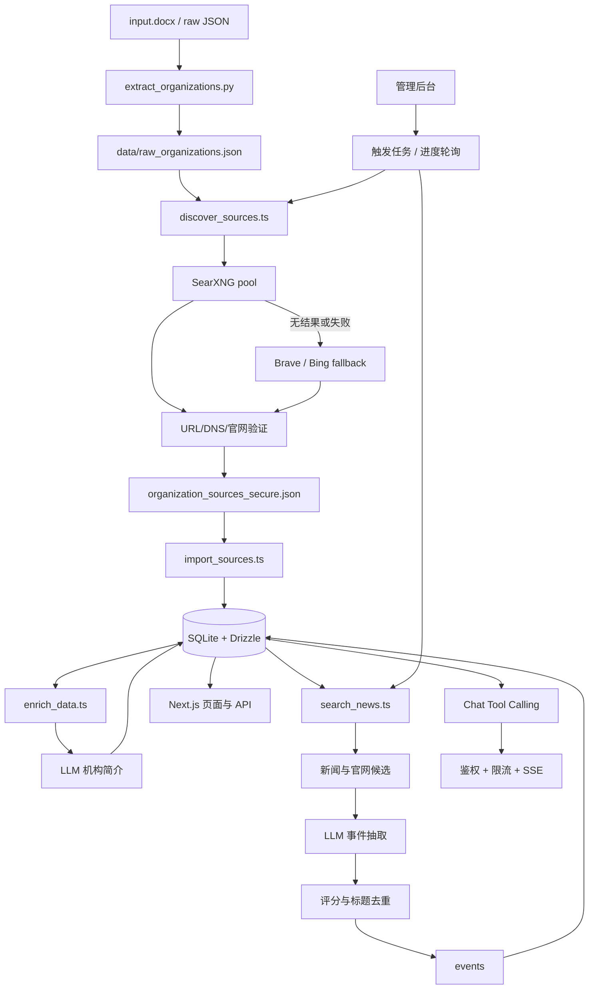

# Institution Intelligence

Institution Intelligence 是一个面向研究、投资和产业团队的机构情报系统。项目采用“安全基座 + AI 引擎”架构，将公开机构资料、官网来源和新闻事件整理为可检索、可追溯的数据资产。

仅允许采集合法授权的公开信息。请遵守目标站点的 robots 规则、服务条款、频率限制及适用法律。

## 核心特性

### 数据管道

- 📄 DOCX/JSON 机构名称提取、标准化与去重
- 🔎 SearXNG 多实例来源发现
- 🔁 SearXNG 失败时按顺序使用 Brave/Bing fallback
- 🛡️ URL 协议、DNS 公网地址和官网内容验证
- 💾 SQLite/Drizzle 增量导入、checkpoint 与原子备份

### AI 治理

- 🧹 官网正文清洗和机构简介生成
- 🤖 LLM 事件抽取、分类和摘要
- 📊 `relevanceScore` 评分，默认过滤低于 6 分的事件
- ♻️ 标题相似度去重和跨批次 URL 去重
- 💬 `search_institution_database` Tool Calling 防止无依据回答

### 安全与鉴权

- 🔐 用户会话鉴权和会话撤销
- 🚦 用户维度速率限制与请求体大小限制
- 🌐 私网、环回地址、保留地址和非官方域名阻断
- 🔒 管理员 API Token 校验
- 📡 SSE 错误脱敏和上游超时控制

### 可视化调度

- 📈 来源发现和事件搜索进度文件
- 🖥️ 管理后台触发任务并轮询进度
- ⏯️ 按机构状态断点恢复
- 🧾 失败任务、困难机构和历史结果备份

## 系统架构



## 技术栈

- Next.js、React、TypeScript、Vinext
- Drizzle ORM、SQLite、`@libsql/client`
- Ollama 或 OpenAI-compatible LLM
- SearXNG、Brave Search API、Bing Search API
- Undici、Cheerio
- Node Test Runner、ESLint、TypeScript

## 快速开始

环境要求：Node.js `>=22.13.0`、npm、Python 3（仅提取 DOCX 时需要）、独立运行的 SearXNG，以及可选的 Ollama。

```bash
npm install
npm run db:generate
npm run db:init
npm run data:extract-organizations
npm run data:discover-sources
npm run db:import-sources
npm run ai:enrich
npm run ai:search-news
npm run dev
```

### 初始化首个管理员账号

复制 `.env.example` 为 `.env.local`，配置 `AUTH_EMAIL` 和 `AUTH_PASSWORD`。启动服务后，访问 `/login` 并使用该账号密码登录，系统将自动完成账号初始化。生产环境请配置 `AUTH_PASSWORD_HASH`，不要使用明文 `AUTH_PASSWORD`。

常用命令：

```bash
npm run data:discover-sources -- --searxng --resume --limit 20
npm run ai:search-news -- --resume --limit 50
npm run ai:translate
npm run lint
npm test
```

## 环境变量

复制 `.env.example` 为 `.env.local`，不要提交真实密钥。

| 变量 | 说明 |
| --- | --- |
| `LOCAL_SQLITE_PATH` | 本地 SQLite 文件路径 |
| `LLM_BASE_URL` | Ollama 或其他 OpenAI-compatible 地址 |
| `LLM_API_KEY` | LLM API 密钥；本地 Ollama 通常为 `ollama` |
| `LLM_MODEL_NAME` | LLM 模型名称 |
| `FINE_TUNED_MODEL_BASE_URL` | 可选微调模型地址 |
| `FINE_TUNED_MODEL_NAME` | 可选微调模型名称 |
| `SEARXNG_URLS` | 逗号分隔的 SearXNG 实例池 |
| `SEARXNG_URL` | 单实例兼容配置 |
| `SEARXNG_ENGINES` | SearXNG 引擎列表，默认值为 `google,bing,duckduckgo,baidu,startpage,qwant`。系统支持多引擎配置，若实例不支持 `engines` 参数会自动降级查询。 |
| `BRAVE_SEARCH_API_KEY` | Brave fallback 密钥 |
| `BING_SEARCH_API_KEY` | Bing fallback 密钥 |
| `AUTH_EMAIL` | 初始登录邮箱 |
| `AUTH_PASSWORD` | 本地初始化密码 |
| `AUTH_PASSWORD_HASH` | 生产环境密码哈希 |
| `AUTH_SESSION_SECRET` | 会话签名密钥 |
| `CREDENTIAL_ENCRYPTION_KEY` | Worker 凭据加密密钥 |
| `ADMIN_API_TOKEN` | 管理后台 API Token |

## 管理后台

访问 `/admin`，使用管理员 Token 验证后可触发：

- 机构来源搜索：`POST /api/admin/trigger-search`
- 事件搜索：`POST /api/admin/trigger-event-search`
- 来源进度：`GET /api/admin/search-progress`
- 事件进度：`GET /api/admin/event-search-progress`

任务由独立 Node 子进程执行。后台通过进度文件轮询显示处理数量、成功数量、失败数量和当前机构；任务中断后可使用 `--resume` 继续。

## 数据与安全

运行数据、密钥、`.local/`、`data/`、DOCX 输入、checkpoint 和备份文件不应提交到 Git。所有数据库写入使用参数化查询或 ORM；抓取任务必须遵守站点规则和频率限制。
