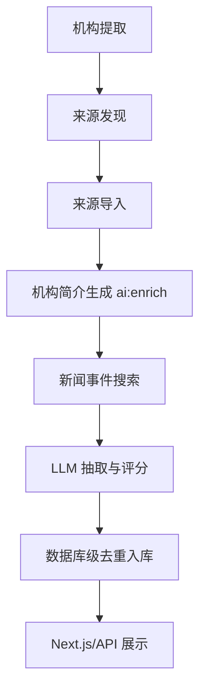

# 数据工作流

## 标准数据流

标准执行顺序：

1. `npm run data:extract-organizations`
2. `npm run data:discover-sources`
3. `npm run db:import-sources`
4. `npm run ai:enrich`
5. `npm run ai:search-news`

`ai:enrich` 是独立、可断点续传的简介生成步骤，必须在新闻搜索前执行。生成内容会同时写入 `organizations.description` 和 `organizations.summary`。

## 可观测性

- `data/search_progress.json`：来源发现进度。
- `data/enrich_progress.json`：简介生成 checkpoint。
- `data/event_search_progress.json`：事件搜索进度。
- `[漏斗]` 日志：原始候选、LLM 保留和去重入库数量。

所有网络请求受连接池、并发限制和超时控制；事件搜索按时间窗口过滤，并在数据库层按来源 URL 防重。
