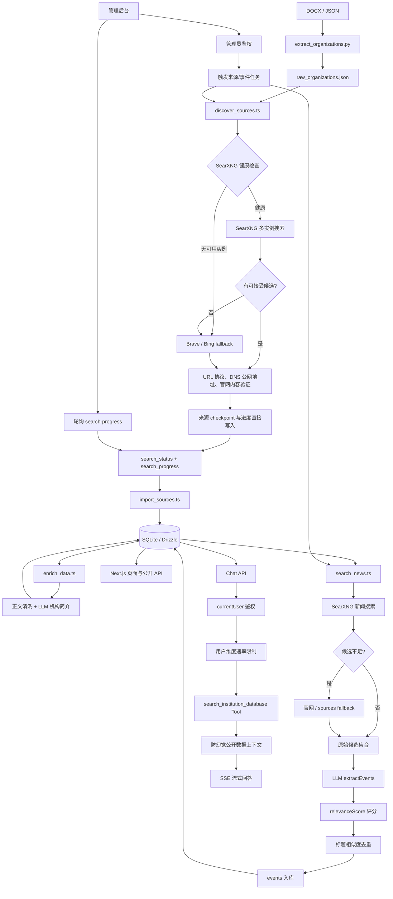

# 数据工作流

本文档说明融合版机构情报系统从原始机构名单到前端展示和 Agent 问答的完整链路。

## 总体流程



## 机构名单处理

入口为 `scripts/data-pipeline/extract_organizations.py`。脚本从 DOCX 或 JSON 提取机构名称，执行空白清洗、名称标准化和去重，生成 `data/raw_organizations.json`。该文件是后续导入的完整基线，不能仅用搜索结果覆盖。

## 来源发现

`discover_sources.ts` 启动时调用 `checkSearxngPool`，优先使用可配置的 SearXNG 多引擎聚合（默认支持 Google、Bing、DuckDuckGo、Baidu、Startpage 和 Qwant）。查询无结果或实例失败时，自动降级到 Brave/Bing API。所有 provider 的结果统一经过：

1. HTTP/HTTPS 协议检查。
2. 社交媒体、百科和明显非官方域名排除。
3. DNS 解析及私网、环回、保留地址阻断。
4. 机构名称匹配和官网内容验证。

每个机构完成后立即更新 `organizations.last_searched_at`、`organizations.search_status` 和 `data/search_progress.json`。进度文件采用直接覆盖写入策略，避免 Windows 环境下前端轮询读取导致的 EPERM 锁冲突。

## 事件搜索与质量治理

`search_news.ts` 保留 B 的规则化搜索、官网 fallback 和断点恢复。原始候选不会直接写入 `events`，而是先交给 A 的 `extractEvents`：

- 标准化标题、摘要和日期。
- 生成 `event_type`。
- 生成 `relevance_score`（1-10）。

随后由 `filterQualityAndDuplicates` 丢弃低于 6 分的事件，并按标题相似度去重。通过质量门槛的事件才执行 URL 去重和数据库写入，最后更新 `last_event_searched_at`、`event_search_status` 与事件进度文件。

## Agent 问答

`app/api/chat/route.ts` 采用“安全外壳 + AI 内核”：请求先通过 `currentUser` 鉴权、会话归属检查、请求体大小校验和用户维度速率限制。涉及机构或事件的问题通过 `search_institution_database` 查询公开字段，查询结果作为工具上下文提供给模型。最终响应使用 SSE 返回 `start`、`delta`、`done` 或脱敏后的 `error` 事件。

## 管理后台调度

管理页面 `/admin` 通过管理员 Token 验证后提供两类任务：

- 来源发现：`POST /api/admin/trigger-search`
- 事件搜索：`POST /api/admin/trigger-event-search`

进度接口：

- `GET /api/admin/search-progress`
- `GET /api/admin/event-search-progress`

后台按固定间隔轮询进度文件。任务由独立 Node 子进程执行，进程异常会将状态标记为 `failed`；已写入的 checkpoint 可使用 `--resume` 恢复。

## 数据库迁移

数据库 schema 位于 `db/schema.ts`，迁移位于 `drizzle/`。搜索调度、事件搜索状态和 `relevance_score` 分别由 `0002`、`0003`、`0004` 提供。修改 schema 时必须同时生成迁移，并在本地执行：

```bash
npm run db:generate
npm run db:init
```

## 验证与排障

```bash
npx tsc --noEmit
npm run lint
npm test
```

优先检查对应进度文件、任务子进程日志、SearXNG 健康状态、Brave/Bing 密钥、LLM endpoint 和数据库迁移状态。不要提交密钥、原始 DOCX、运行数据、checkpoint 或 `.local/` 文件。
