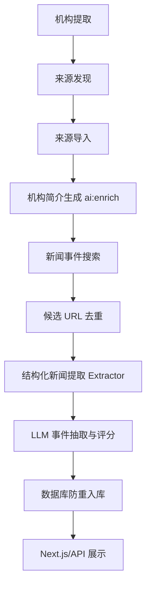

# 数据工作流

## 标准数据流

标准执行顺序：

1. `npm run data:extract-organizations`
2. `npm run data:discover-sources`
3. `npm run db:import-sources`
4. `npm run ai:enrich`
5. `npm run ai:search-news`

`ai:enrich` 是独立、可断点续传的简介生成步骤，必须在新闻搜索前执行。生成内容会同时写入 `organizations.description` 和 `organizations.summary`。

## 每日 AI 情报简报

每日简报由 `npm run ai:daily-briefing` 触发，可通过系统 cron 或 CI 定时任务在每天固定时间执行。任务查询最近 24 小时内新增且 `relevance_score >= 6` 的事件，并关联机构名称；时间窗口、最低分数和事件上限可通过 `DAILY_BRIEFING_*` 环境变量调整。

筛选后的事件会交给 LLM 生成结构化 Markdown 洞察，随后由 `lib/notifier.ts` 按 `WEBHOOK_PROVIDER` 构造飞书、钉钉、企业微信或通用 Webhook 消息并推送。每次执行都会在 `briefing_runs` 中记录窗口、内容哈希、生成和推送状态；窗口与内容哈希的唯一约束保证重复触发时幂等，不会重复推送同一份简报。

## 可观测性

- `data/search_progress.json`：来源发现进度。
- `data/enrich_progress.json`：简介生成 checkpoint。
- `data/event_search_progress_<taskId>.json`：按任务隔离的事件搜索进度；管理端可通过 `taskId` 查询，未指定时读取最近任务。
- `[漏斗]` 日志：原始候选、Extractor 各策略结果、LLM 保留和去重入库数量。

所有网络请求受连接池、并发限制和超时控制；事件搜索按时间窗口过滤，并在数据库层按来源 URL 防重。
